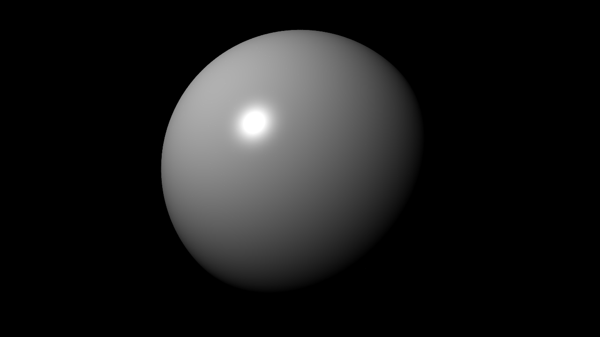
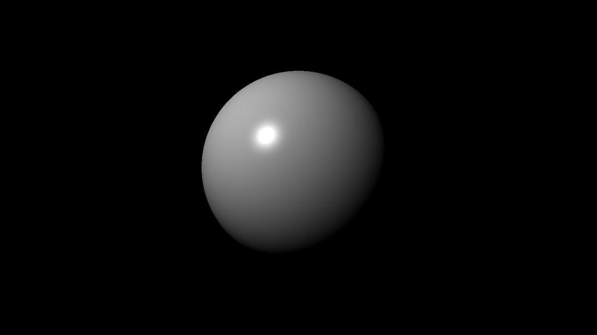
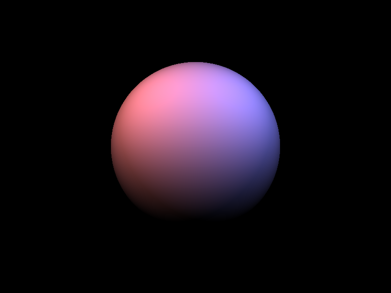

# Micro-RT

Lightweight raytracing microservice written in [Rust](https://www.rust-lang.org/).

The main idea is to use flags or [json](https://www.json.org/json-en.html) for generating images in terminal, shell scripts, http servers and etc.

It's something like [Zenity](https://github.com/GNOME/zenity), that provides you to create simple UI in terminal.

## Build
Build statically for [linux](https://en.wikipedia.org/wiki/Linux) using [musl](https://musl.libc.org/). This executable may run on any linux system without any additional libs.

```bash
rustup target add x86_64-unknown-linux-musl
cargo build --release --target x86_64-unknown-linux-musl
```

## Usage
```bash
$ ./raytrace -h 
Tiny raytracing microservice.

Usage: raytrace [OPTIONS]

Options:
  -v, --verbose
          Print full info in json
      --pretty
          Print full info in json with prettifier
  -d, --dry
          Dry run (useful with verbose)
  -o, --output <FILE.EXT>
          Final image output filename
      --bounce <BOUNCE>
          Max ray bounce
      --sample <SAMPLE>
          Max path-tracing samples
      --loss <LOSS>
          Ray bounce energy loss
  -u, --update
          Save output on each sample
  -w, --worker <WORKER>
          Parallel workers count
  -s, --scene <FILE.json>
          Scene description json input filename
  -f, --frame <FILE.json>
          Frame description json input filename
      --res <w> <h>
          Frame output image resolution
      --cam <pos: <f32 f32 f32>> <dir: <f32 f32 f32>> <fov: <f32>> <gamma: <f32>> <exp: <f32>>...
          Add camera to the scene
      --obj [<<type: sphere(sph)|plane(pln)>> <param: <sphere: r: <f32>>|<plane: n: <f32 f32 f32>>> <pos: <f32 f32 f32>> <albedo: <f32 f32 f32>> <rough: <f32>> <metal: <f32>> <glass: <f32>> <opacity: <f32>> <emit>...]
          Add renderer to the scene
      --light [<param: <point(pt): <f32 f32 f32>>|<dir: <f32 f32 f32>>> <pwr: <f32>> <col: <f32 f32 f32>>...]
          Add light source to the scene
      --sky <r> <g> <b>
          Scene sky color
  -h, --help
          Print help information
  -V, --version
          Print version information
```

### In-place in terminal
Let's render simple scene with sphere in terminal:

```bash
raytrace --obj sphere --light point: -0.5 -1 0.5
```

It will produce an PNG image 800x600:


Now let's change a resolution and output file:
```bash
raytrace --obj sphere --light point: -0.5 -1 0.5 --res 1280 720 -o final.ppm
```



Let's make something interesting (it will take some time):

```bash
raytrace --obj sphere r: 0.2 pos: -0.5 0.5 0.7 emit \
         --obj sphere r: 0.2 pos: 0.5 0.5 0 albedo: 1 0.76 0.47 emit \
         --obj sph r: 0.2 pos: -0.5 0 0 rough: 1 \
         --obj sph r: 0.2 pos: 0 0.5 0 albedo: 1 0 0 \
         --obj sph r: 0.2 pos: 0.5 0 0 metal: 1 \
         --obj sph r: 0.2 pos: -0.15 -0.5 0 glass: 0.08 opacity: 0 \
         --obj pln pos: 0 0 -0.201 rough: 1 \
         --obj pln n: 0 0 -1 pos: 0 0 1 rough: 1 \
         --obj pln n: -1 0 0 pos: 1 0 0 albedo: 0 1 0 rough: 1 \
         --obj pln n: 1 0 0 pos: -1 0 0 albedo: 1 0 0 rough: 1 \
         --obj pln n: 0 -1 0 pos: 0 1 0 rough: 1 \
         --cam pos: 0 -1.2 0.1 fov: 60 gamma: 0.42 exp: 0.58 \
         --bounce 256 --sample 1024
```



### JSON frame and scene description
1. First create `scene.json` file contains scene information:
```json
{
    "renderer": [
        {
            "type": "plane",
            "n": [0, -1, 0],
            "pos": [0, 1, 0],
            "mat": {
                "rough": 1
            }
        },
        {
            "type": "plane",
            "n": [1, 0, 0],
            "pos": [-1, 0, 0],
            "mat": {
                "albedo": [1, 0, 0],
                "rough": 1
            }
        },
        {
            "type": "plane",
            "n": [-1, 0, 0],
            "pos": [1, 0, 0],
            "mat": {
                "albedo": [0, 1, 0],
                "rough": 1
            }
        },
        {
            "type": "plane",
            "n": [0, 0, -1],
            "pos": [0, 0, 1],
            "mat": {
                "rough": 1
            }
        },
        {
            "type": "plane",
            "n": [0, 0, 1],
            "pos": [0, 0, -0.2],
            "mat": {
                "rough": 1
            }
        },
        {
            "type": "sphere",
            "r": 0.2,
            "pos": [-0.15, -0.5, 0],
            "mat": {
                "glass": 0.08,
                "opacity": 0
            }
        },
        {
            "type": "sphere",
            "r": 0.2,
            "pos": [0.5, 0, 0],
            "mat": {
                "metal": 1
            }
        },
        {
            "type": "sphere",
            "r": 0.2,
            "pos": [0, 0.5, 0],
            "mat": {
                "albedo": [1, 0, 0]
            }
        },
        {
            "type": "sphere",
            "r": 0.2,
            "pos": [-0.5, 0, 0],
            "mat": {
                "rough": 1
            }
        },
        {
            "type": "sphere",
            "r": 0.2,
            "pos": [0.5, 0.5, 0],
            "mat": {
                "albedo": [1, 0.76, 0.47],
                "emit": true
            }
        },
        {
            "type": "sphere",
            "r": 0.2,
            "mat": {
                "emit": true
            },
            "pos": [-0.5, 0.5, 0.7]
        }
    ]
}
```

2. Next create `frame.json` file contains output frame information:
```json
{
    "res": [800, 600],
    "cam": {
        "dir": [0, 1, 0],
        "exp": 0.58,
        "fov": 60,
        "gamma": 0.42,
        "pos": [0, -1.2, 0.1]
    }
}
```

3. Finally, run following command (it will take some time):

```bash
raytrace --scene scene.json --frame frame.json --sample 1024
```


### Terminal to json

1. Also you can use `--verbose,-v` flag with `--dry,-d` to get full info in json from cli command:
```bash
raytrace -v -d --obj sphere --light point: -0.5 -1 0.5
```

```json
{"frame":{"cam":{"dir":[0.0,1.0,0.0],"exp":0.20000000298023224,"fov":90.0,"gamma":0.800000011920929,"pos":[0.0,-1.0,0.0]},"res":[800,600]},"rt":{"bounce":8,"loss":0.15000000596046448,"sample":16},"scene":{"light":[{"color":[1.0,1.0,1.0],"pos":[-0.5,-1.0,0.5],"pwr":0.5,"type":"point"}],"renderer":[{"mat":{"albedo":[1.0,1.0,1.0],"emit":false,"glass":0.0,"metal":0.0,"opacity":1.0,"rough":0.0},"pos":[0.0,0.0,0.0],"r":0.5,"type":"sphere"}],"sky":[0.0,0.0,0.0]}}
```

2. With prettifier:
```bash
raytrace -v -d --pretty --obj sphere --light point: -0.5 -1 0.5
```

```json
{
    "frame": {
        "cam": {
            "dir": [0, 1, 0],
            "exp": 0.20000000298023224,
            "fov": 90,
            "gamma": 0.800000011920929,
            "pos": [0, -1, 0]
        },
        "res": [800, 600]
    },
    "rt": {
        "bounce": 8,
        "loss": 0.15000000596046448,
        "sample": 16
    },
    "scene": {
        "light": [
            {
                "color": [1, 1, 1],
                "pos": [-0.5, -1, 0.5],
                "pwr": 0.5,
                "type": "point"
            }
        ],
        "renderer": [
            {
                "mat": {
                    "albedo": [1, 1, 1],
                    "emit": false,
                    "glass": 0,
                    "metal": 0,
                    "opacity": 1,
                    "rough": 0
                },
                "pos": [0, 0, 0],
                "r": 0.5,
                "type": "sphere"
            }
        ],
        "sky": [0, 0, 0]
    }
}
```

## API
TBD...
