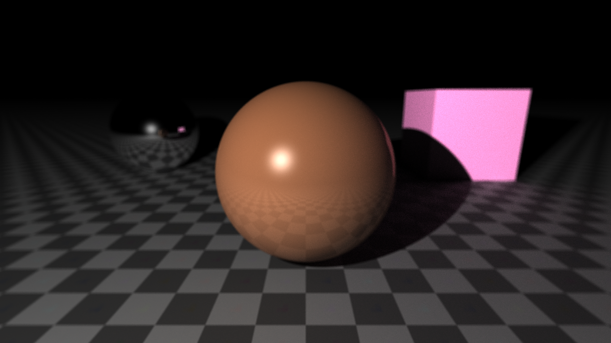
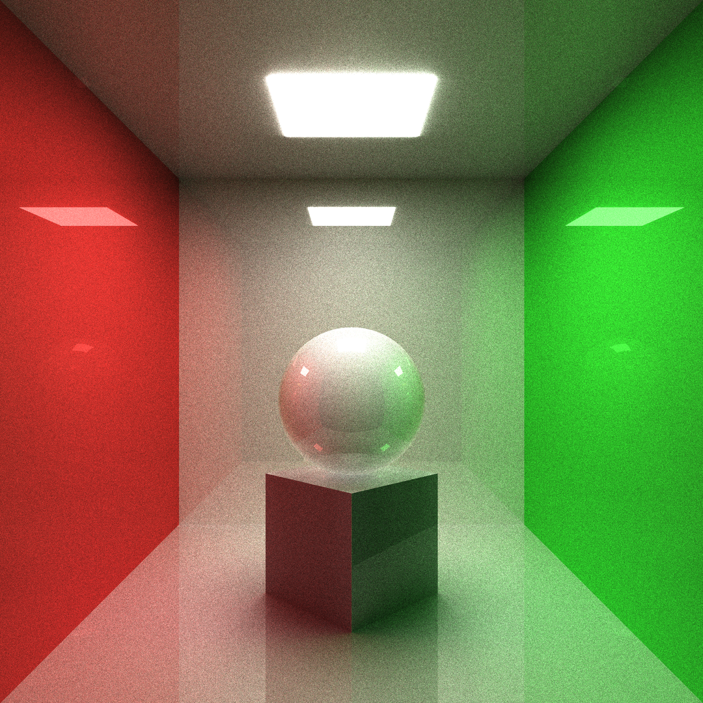
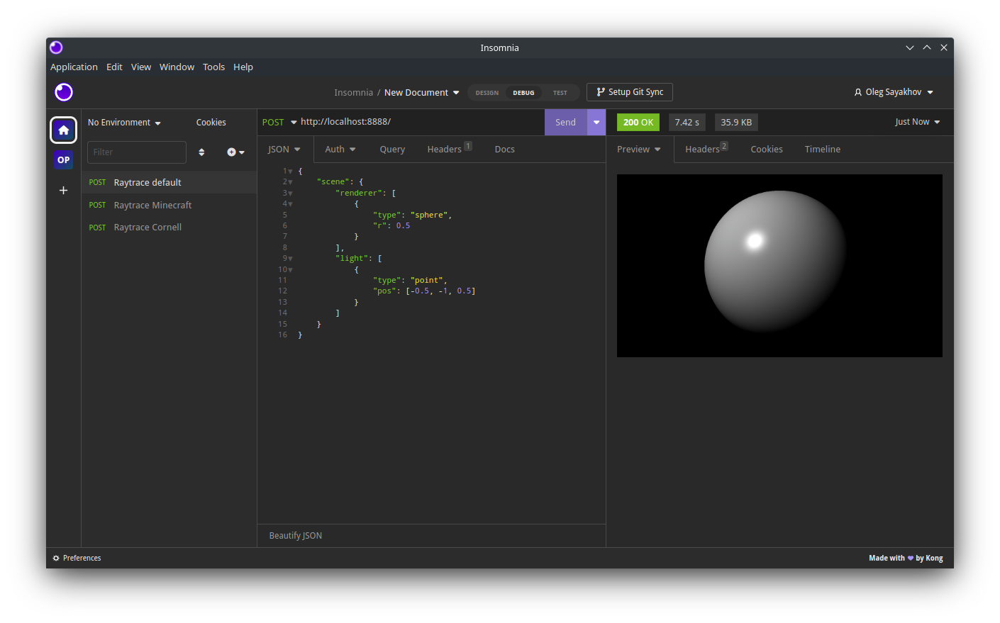

# Micro-RT


Lightweight raytracing microservice written in [Rust](https://www.rust-lang.org/).

The main idea is to easy render images instantly in terminal, with [json](https://www.json.org/json-en.html) file or over [http](https://en.wikipedia.org/wiki/Hypertext_Transfer_Protocol) server.

Inspired by [Zenity](https://github.com/GNOME/zenity), that provides you to create simple UI in terminal.






```bash
raytrace --obj sph r: 0.15 pos: 0 0 -0.1 \
         --obj box size: 0.25 0.25 0.25 pos: 0 0 -0.375 dir: 0 0.5 0.5 0 \
         --obj box size: 0.3 0.3 0.01 pos: 0 0 0.499 emit: 1 \
         --obj box size: 1 0.01 1 pos: 0 0.5 0 \
         --obj box size: 1 1 0.01 pos: 0 0 0.5 \
         --obj box size: 1 1 0.01 pos: 0 0 -0.5 \
         --obj box size: 0.01 1 1 pos: -0.5 0 0 albedo: '#ff0000' \
         --obj box size: 0.01 1 1 pos: 0.5 0 0 albedo: '#00ff00' \
         --cam pos: 0 -1.25 0 fov: 60 gamma: 0.6 exp: 0.8 \
         --update --sample 1024 --ssaa 2 --res 1080 1080
```

## Table of Contents
- [Build](#build)
- [Usage](#usage)
    - [In-place in terminal](#in-place-in-terminal)
    - [JSON render description](#json-render-description)
    - [HTTP server](#http-server)
    - [Terminal to json](#terminal-to-json)
- [API](#api)

## Build
Build statically for [linux](https://en.wikipedia.org/wiki/Linux) using [musl](https://musl.libc.org/). This executable may run on any linux system without any additional libs.

```bash
rustup target add x86_64-unknown-linux-musl
cargo build --release --target x86_64-unknown-linux-musl
```

## Usage
```bash
$ ./raytrace -h 
Tiny raytracing microservice.

Usage: raytrace [OPTIONS] [FILE.json]

Arguments:
  [FILE.json]
          Full render description json input filename

Options:
  -v, --verbose
          Enable logging
      --pretty
          Print full render info in json with prettifier
  -d, --dry
          Dry run (useful with verbose)
  -o, --output <FILE.EXT>
          Final image output filename
      --http <address>
          Launch http server
      --bounce <BOUNCE>
          Max ray bounce
      --sample <SAMPLE>
          Max path-tracing samples
      --loss <LOSS>
          Ray bounce energy loss
  -u, --update
          Save output on each sample
  -w, --worker <WORKER>
          Parallel workers count
      --dim <DIM>
          Parallel jobs count on each dimension
  -s, --scene <FILE.json>
          Scene description json input filename
  -f, --frame <FILE.json>
          Frame description json input filename
      --res <w> <h>
          Frame output image resolution
      --ssaa <SSAA>
          Output image SSAAx antialiasing
      --cam <pos: <f32 f32 f32>> <dir: <f32 f32 f32 f32>> <fov: <f32>> <gamma: <f32>> <exp: <f32>> <aprt: <f32>> <foc: <f32>>...
          Add camera to the scene
      --obj [<type: sphere(sph)|plane(pln)|box|triangle(tri)> <name: <str>> <param: <sphere: r: <f32>>|<plane: n: <f32 f32 f32>>|<box: size: <f32 f32 f32>>|<triangle: <f32 f32 f32> <f32 f32 f32> <f32 f32 f32>>> <pos: <f32 f32 f32>> <dir: <f32 f32 f32 f32>> <albedo: <f32 f32 f32>|hex> <rough: <f32>> <metal: <f32>> <glass: <f32>> <opacity: <f32>> <emit: <f32>> <tex: <FILE.ext|<base64 str>>> <rmap: <FILE.ext|<base64 str>>> <mmap: <FILE.ext|<base64 str>>> <gmap: <FILE.ext|<base64 str>>> <omap: <FILE.ext|<base64 str>>> <emap: <FILE.ext|<base64 str>>>...]
          Add renderer to the scene
      --light [<param: <point(pt): <f32 f32 f32>>|<dir: <f32 f32 f32>>> <pwr: <f32>> <col: <f32 f32 f32>|hex>...]
          Add light source to the scene
      --sky <<f32 f32 f32>|hex> <pwr>...
          Scene sky color
  -h, --help
          Print help information
  -V, --version
          Print version information
```

```bash
$ ./img2json -h
Convert images to json for micro-rt.

Usage: img2json [OPTIONS] 

Arguments:
  
          Input image filename

Options:
      --pretty
          Print json with prettifier
  -f, --fmt <fmt: <buf|inl>>
          Texture format
  -h, --help
          Print help information
  -V, --version
          Print version information
```

### In-place in terminal
Let's render simple scene with sphere in terminal:

```bash
raytrace --obj sphere --light point: -0.5 -1 0.5
```

It will produce an PNG image 1280x720:


Now let's change the resolution, output file and add some antialiasing:
```bash
raytrace --obj sphere --light point: -0.5 -1 0.5 --res 1920 1080 --ssaa 2 -o final.ppm
```


Let's make something interesting (it will take some time):

```bash
raytrace --obj sph r: 0.2 pos: 0.5 0.5 0 albedo: '#ffc177' emit: 1.0 \
         --obj sph r: 0.2 pos: -0.5 0 0 rough: 1 \
         --obj sph r: 0.2 pos: 0 0.5 0 albedo: '#ff0000' \
         --obj sph r: 0.2 pos: 0.5 0 0 metal: 1 \
         --obj sph r: 0.2 pos: -0.15 -0.5 0 glass: 0.08 opacity: 0 \
         --obj pln pos: 0 0 -0.201 rough: 1 \
         --obj pln n: 0 0 -1 pos: 0 0 1 rough: 1 \
         --obj pln n: -1 0 0 pos: 1 0 0 albedo: '#00ff00' rough: 1 \
         --obj pln n: 1 0 0 pos: -1 0 0 albedo: '#ff0000' rough: 1 \
         --obj pln n: 0 -1 0 pos: 0 1 0 rough: 1 \
         --cam pos: 0 -1.2 0.1 fov: 60 gamma: 0.5 exp: 0.75 \
         --update --bounce 16 --sample 1024
```


### JSON render description
1. First create `scene.json` file contains scene information:
```json
{
    "renderer": [
        {
            "type": "plane",
            "n": [0, -1, 0],
            "pos": [0, 1, 0],
            "mat": {
                "rough": 1
            }
        },
        {
            "type": "plane",
            "n": [1, 0, 0],
            "pos": [-1, 0, 0],
            "mat": {
                "albedo": [1, 0, 0],
                "rough": 1
            }
        },
        {
            "type": "plane",
            "n": [-1, 0, 0],
            "pos": [1, 0, 0],
            "mat": {
                "albedo": [0, 1, 0],
                "rough": 1
            }
        },
        {
            "type": "plane",
            "n": [0, 0, -1],
            "pos": [0, 0, 1],
            "mat": {
                "rough": 1
            }
        },
        {
            "type": "plane",
            "n": [0, 0, 1],
            "pos": [0, 0, -0.2],
            "mat": {
                "rough": 1
            }
        },
        {
            "type": "sphere",
            "r": 0.2,
            "pos": [-0.15, -0.5, 0],
            "mat": {
                "glass": 0.08,
                "opacity": 0
            }
        },
        {
            "type": "sphere",
            "r": 0.2,
            "pos": [0.5, 0, 0],
            "mat": {
                "metal": 1
            }
        },
        {
            "type": "sphere",
            "r": 0.2,
            "pos": [0, 0.5, 0],
            "mat": {
                "albedo": [1, 0, 0]
            }
        },
        {
            "type": "sphere",
            "r": 0.2,
            "pos": [-0.5, 0, 0],
            "mat": {
                "rough": 1
            }
        },
        {
            "type": "sphere",
            "r": 0.2,
            "pos": [0.5, 0.5, 0],
            "mat": {
                "albedo": [1, 0.76, 0.47],
                "emit": 1
            }
        }
    ]
}
```

2. Next create `frame.json` file contains output frame information:
```json
{
    "res": [1280, 720],
    "ssaa": 1,
    "cam": {
        "dir": [0, 0, 1, 0],
        "exp": 0.75,
        "fov": 70,
        "gamma": 0.5,
        "pos": [0, -1.2, 0.1]
    }
}
```

3. Also, render file `example.json` contains all information may be used:
```json
{
    "rt": {
        "sample": 512
    },
    "frame": {
        "cam": {
            "exp": 0.75,
            "fov": 60,
            "gamma": 0.5,
            "pos": [0, -1.2, 0.1]
        }
    },
    "scene": {
        "renderer": [
            {
                "type": "plane",
                "n": [0, -1, 0],
                "pos": [0, 1, 0],
                "mat": {
                    "rough": 1
                }
            },
            {
                "type": "plane",
                "n": [1, 0, 0],
                "pos": [-1, 0, 0],
                "mat": {
                    "albedo": "#ff0000",
                    "rough": 1
                }
            },
            {
                "type": "plane",
                "n": [-1, 0, 0],
                "pos": [1, 0, 0],
                "mat": {
                    "albedo": "#00ff00",
                    "rough": 1
                }
            },
            {
                "type": "plane",
                "n": [0, 0, -1],
                "pos": [0, 0, 1],
                "mat": {
                    "rough": 1
                }
            },
            {
                "type": "plane",
                "n": [0, 0, 1],
                "pos": [0, 0, -0.2],
                "mat": {
                    "rough": 1
                }
            },
            {
                "type": "sphere",
                "r": 0.2,
                "pos": [-0.15, -0.5, 0],
                "mat": {
                    "glass": 0.08,
                    "opacity": 0
                }
            },
            {
                "type": "sphere",
                "r": 0.2,
                "pos": [0.5, 0, 0],
                "mat": {
                    "metal": 1
                }
            },
            {
                "type": "sphere",
                "r": 0.2,
                "pos": [0, 0.5, 0],
                "mat": {
                    "albedo": "#ff0000"
                }
            },
            {
                "type": "sphere",
                "r": 0.2,
                "pos": [-0.5, 0, 0],
                "mat": {
                    "rough": 1
                }
            },
            {
                "type": "sphere",
                "r": 0.2,
                "pos": [0.5, 0.5, 0],
                "mat": {
                    "albedo": "#ffc177",
                    "emit": 1.0
                }
            }
        ]
    }    
}
```

4. Finally, run following command (it will take some time):

```bash
raytrace --scene scene.json --frame frame.json --sample 1024
```

```bash
raytrace example.json --sample 1024
```


In most cases single render description file is more prefered. Separation of scene and frame is useful to change some camera position, resolution etc. without updating full scene file.

### HTTP server
1. Run the http server with the following command:
```bash
raytrace --http localhost:8888
```

2. Send a `POST` http request with render description in json body:


It will return an http response with JPEG encoded output.

### Terminal to json

1. Also you can use `--verbose,-v` flag with `--dry,-d` to get full render info in json from cli command:
```bash
raytrace -v -d --obj sphere --light point: -0.5 -1 0.5
```

```json
{"rt":{"bounce":8,"sample":16,"loss":0.15},"frame":{"res":[1280,720],"ssaa":1.0,"cam":{"pos":[-0.0,-1.0,-0.0],"dir":[0.0,0.0,1.0,0.0],"fov":70.0,"gamma":0.8,"exp":0.2,"aprt":0.001,"foc":100.0}},"scene":{"renderer":[{"type":"sphere","r":0.5,"mat":{"albedo":[1.0,1.0,1.0],"rough":0.0,"metal":0.0,"glass":0.0,"opacity":1.0,"emit":0.0,"tex":null,"rmap":null,"mmap":null,"gmap":null,"omap":null,"emap":null},"pos":[0.0,0.0,0.0],"dir":[0.0,0.0,1.0,0.0],"name":null}],"light":[{"type":"point","pos":[-0.5,-1.0,0.5],"pwr":0.5,"color":[1.0,1.0,1.0]}],"sky":{"color":[0.0,0.0,0.0],"pwr":0.5}}}
```

2. With prettifier:
```bash
raytrace -v -d --pretty --obj sphere --light point: -0.5 -1 0.5
```

```json
{
    "rt": {
        "bounce": 8,
        "sample": 16,
        "loss": 0.15
    },
    "frame": {
        "res": [1280, 720],
        "ssaa": 1,
        "cam": {
            "pos": [0, -1, 0],
            "dir": [0, 0, 1, 0],
            "fov": 70,
            "gamma": 0.8,
            "exp": 0.2,
            "aprt": 0.001,
            "foc": 100
        }
    },
    "scene": {
        "renderer": [
            {
                "name": null,
                "type": "sphere",
                "r": 0.5,
                "mat": {
                    "albedo": [1, 1, 1],
                    "rough": 0,
                    "metal": 0,
                    "glass": 0,
                    "opacity": 1,
                    "emit": 0,
                    "tex": null,
                    "rmap": null,
                    "mmap": null,
                    "gmap": null,
                    "omap": null,
                    "emap": null
                },
                "pos": [0, 0, 0],
                "dir": [0, 0, 1, 0]
            }
        ],
        "light": [
            {
                "type": "point",
                "pos": [-0.5, -1, 0.5],
                "pwr": 0.5,
                "color": [1, 1, 1]
            }
        ],
        "sky": {
            "color": [0, 0, 0],
            "pwr": 0.5
        }
    }
}
```

## API
TBD...
