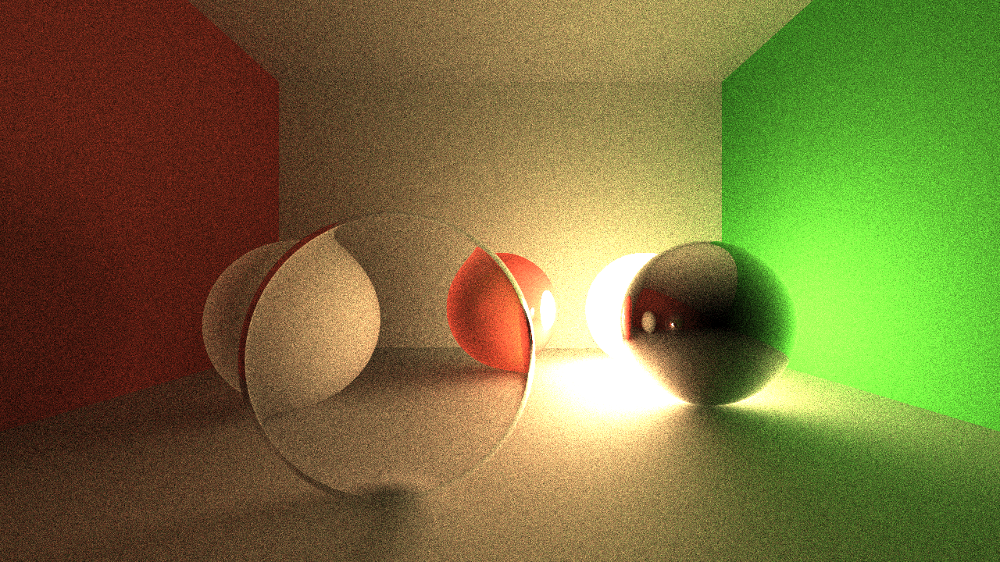

# Raytracing Microservice

Lightweight raytracing microservice written in [Rust](https://www.rust-lang.org/).

The main idea is to use flags or [json](https://www.json.org/json-en.html) for generating images in terminal, shell scripts, http servers and etc.

It's something like [Zenity](https://github.com/GNOME/zenity), that provides you to create simple UI in terminal.

## Build
Build statically for [linux](https://en.wikipedia.org/wiki/Linux) using [musl](https://musl.libc.org/). This executable may run on any linux system without any additional libs.

```bash
rustup target add x86_64-unknown-linux-musl
cargo build --release --target x86_64-unknown-linux-musl
```

## Usage
```bash
./raytrace -h
Tiny raytracing microservice.

Usage: raytrace [OPTIONS]

Options:
  -v, --verbose                         Print frame and scene json info
      --pretty                          Print frame and scene json info with pretty
  -o, --output <FILE.EXT>               Final image output filename
      --bounce <BOUNCE>                 Max ray bounce
      --sample <SAMPLE>                 Max path-tracing samples
      --loss <LOSS>                     Ray bounce energy loss
  -u, --update                          Save output on each sample
  -w, --worker <WORKER>                 Parallel workers count
  -s, --scene <FILE.json>               Scene description json input filename
  -f, --frame <FILE.json>               Frame description json input filename
      --res <w> <h>                     Frame output image resolution
      --cam <pos> <dir> <fov>...        Frame camera
      --sphere [<pos> <r> <albedo>...]  Render sphere
      --light [<pos> <pwr> <col>...]    Light source
  -h, --help                            Print help information
  -V, --version                         Print version information
```

### In-place in terminal
Let's render simple scene with sphere in terminal:
```bash
raytrace --sphere --light pos: -0.5 -1 0.5
```

It will produce an PNG image 800x600:


Now let's change a resolution and output file:
```bash
raytrace --sphere --light pos: -0.5 -1 0.5 --res 1280 720 -o final.ppm
```


### JSON frame and scene description
1. First create `scene.json` file contains scene information:
```json
{
    "renderer": [
        {
            "type": "sphere",
            "r": 0.2,
            "mat": {
                "albedo": [1, 0.917647058824, 0.596078431372],
                "emit": true
            }
        },
        {
            "type": "sphere",
            "pos": [0.5, 0, 0],
            "r": 0.2,
            "mat": {
                "albedo": [1, 1, 1],
                "metal": 1
            }
        },
        {
            "type": "sphere",
            "pos": [-0.25, -0.5, 0],
            "r": 0.2,
            "mat": {
                "glass": 0.2,
                "opacity": 0
            }
        },
        {
            "type": "sphere",
            "pos": [-0.5, 0, 0],
            "r": 0.2,
            "mat": {
                "rough": 1
            }
        },
        {
            "type": "sphere",
            "pos": [0, 0, -100.2],
            "r": 100,
            "mat": {
                "rough": 1
            }
        },
        {
            "type": "sphere",
            "pos": [0, 0, 101.2],
            "r": 100,
            "mat": {
                "rough": 1
            }
        },
        {
            "type": "sphere",
            "pos": [0, 101, 0],
            "r": 100,
            "mat": {
                "rough": 1
            }
        },
        {
            "type": "sphere",
            "pos": [-101, 0, 0],
            "r": 100,
            "mat": {
                "albedo": [1, 0, 0],
                "rough": 1
            }
        },
        {
            "type": "sphere",
            "pos": [101, 0, 0],
            "r": 100,
            "mat": {
                "albedo": [0, 1, 0],
                "rough": 1
            }
        }
    ],
    "light": []
}
```

2. Next create `frame.json` file contains output frame information:
```json
{
    "res": [800, 600],
    "cam": {
        "pos": [0, -2, 0.5],
        "dir": [0, 1, 0],
        "fov": 60,
        "gamma": 0.42
    }
}
```

3. Finally, run following command (it will take some time):

```bash
raytrace --scene scene.json --frame frame.json --sample 1024
```



## API
TBD...
